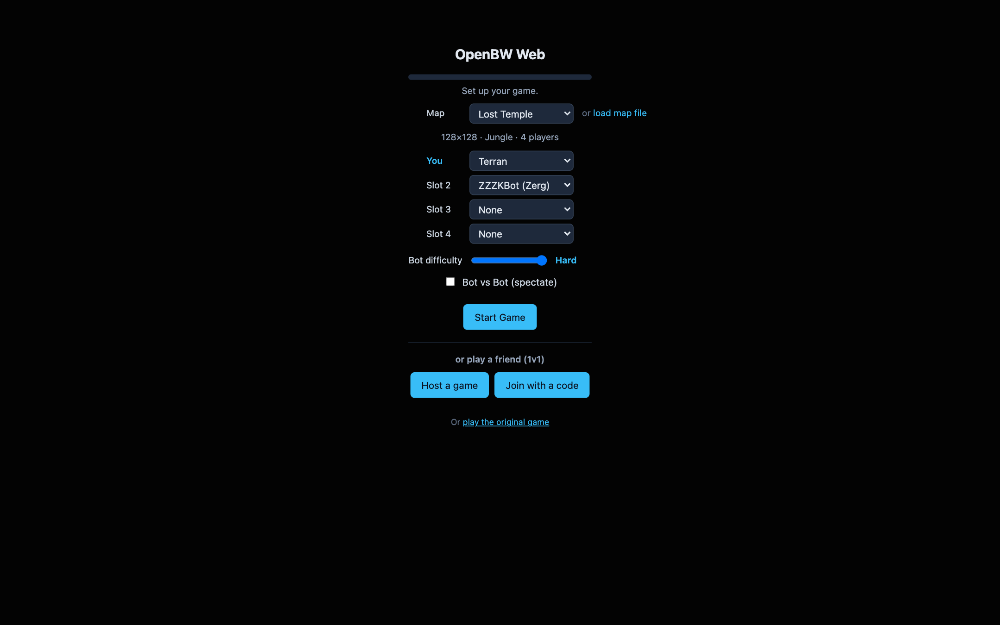
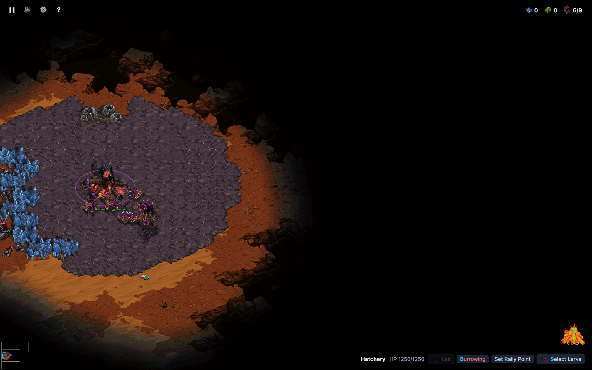
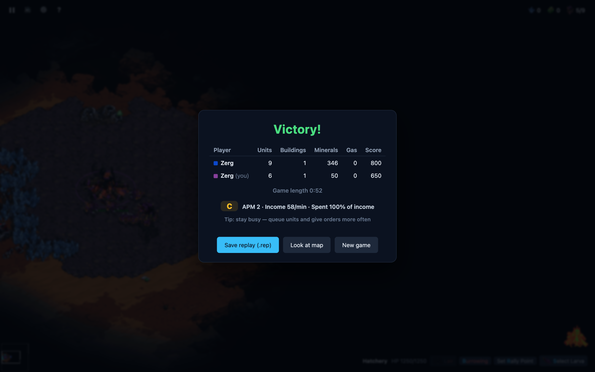

# OpenBW Web

StarCraft: Brood War, playable in the browser — OpenBW's bit-exact engine compiled
to WebAssembly, with real tournament AIs as computer opponents and serverless 1v1
multiplayer.

**▶ Play it now: [openbw.vercel.app](https://openbw.vercel.app)**

No install: the page fetches the game data client-side on first load, then you pick
a map, a race, and an opponent — a bot, or a friend over a copy-paste WebRTC link
(direct-cable style, no server in the middle).

## Screenshots

The lobby — map, races, computer opponents, and the bot difficulty slider:

In-game as Zerg: the Hatchery's command card with the building-morph buttons
(Lair grayed until its Spawning Pool requirement is met):

The end-of-game card grades your play — APM, income, spending efficiency, and a
tip aimed at your weakest metric:

## What's in this fork

On top of [heiner/openbw](https://github.com/heiner/openbw) (the web port this
builds on), this fork adds:

- **Zerg building-morph buttons** on the command card — a Hatchery can morph to
  Lair, Lair to Hive, Creep Colony to Sunken/Spore, Spire to Greater Spire, each
  shown grayed with its "Requires …" prerequisite until available (also submitted
  upstream as [PR #1](https://github.com/heiner/openbw/pull/1)).
- **More restored abilities**: Nydus Canal exits can be built (select a completed
  canal → Build Nydus Exit, placed free on visible creep, ride through with a
  right-click), the Shield Battery has its Recharge Shields button back, and
  Select Larva picks the selected hatchery's own larvae instead of hopping bases.
- **Bot strategy variety.** The computer opponents (ZZZKBot — AIIDE 2015/2017
  winner — and McRave) played the same opening every game: their tournament
  learning files don't exist in the browser, McRave's RNG was never seeded, and a
  port gap hid the opponent's race so McRave always used its tiny vs-Random book.
  All three fixed — every game opens differently now.
- **A bot difficulty slider** (Easy / Normal / Hard). The bot's brain always runs
  at full rate; difficulty adds human-like weakness instead — reaction latency and
  an APM budget (dropped commands get re-issued later), so an Easy bot plays slow
  and clumsy rather than broken. Hard is unthrottled tournament strength.
- **An Elo ladder** ([leaderboard](https://openbw.vercel.app/api/elo?action=table)).
  Register a username + PIN in the lobby and games against the computer are rated:
  each bot × difficulty carries a fixed rating (ZZZKBot 900/1200/1500, McRave
  1000/1350/1700), so the ladder measures who beats which bot at what level.
  Resigning counts as a loss — and so does abandoning (closing the tab mid-game
  fires a parting beacon), so there's no dodging a bad game. It's a friendly
  honor-system ladder: results are reported by the player's own client.
- **A performance grade on the game-over card** — APM, income/min, % of income
  spent, blended into a grade with a coaching tip.
- **Spectator controls** — watching Bot vs Bot, "Stop watching" ends the match on
  the spot and still shows the final score screen.
- **Anonymous usage stats** ([table](https://openbw.vercel.app/api/stats)) — one
  row per game started (map, mode, race, opponent, difficulty; nothing
  identifying), stored in the deployment's own Vercel Blob store. The ladder and
  the stats share that store — no third-party service anywhere.
- **Mobile command-card layout** — icon buttons group on their own row instead of
  wrapping awkwardly.
- **Deploy tooling** for Vercel (`web/deploy-vercel.sh` — stamps the cache-buster
  the way upstream's Pages workflow does) and **headless bot probes** under
  node:wasi (`web/bot-strategy-probe.mjs`, `web/bot-difficulty-probe.mjs`) to
  verify strategy variety and difficulty behavior without a browser.

## Building

- `web/build-wasm.sh` builds the game module (`web/openbw.wasm`) with a
  [WASI SDK](https://github.com/WebAssembly/wasi-sdk):
  `WASI_SDK=/path/to/wasi-sdk bash web/build-wasm.sh`
- The bot modules are built from vendored third-party sources:
  `cd web/bot && ./vendor.sh && ./build-web.sh` (ZZZKBot) and
  `BOT=mcrave ./build-web.sh` (McRave). See `web/bot/README.md`.
- Serve `web/` with any static file server to run locally.

## Upstream

This is a fork of [heiner/openbw](https://github.com/heiner/openbw), itself based
on [OpenBW](https://github.com/OpenBW/openbw). Instructions for building and using
OpenBW (with BWAPI) are at https://github.com/OpenBW/bwapi.
